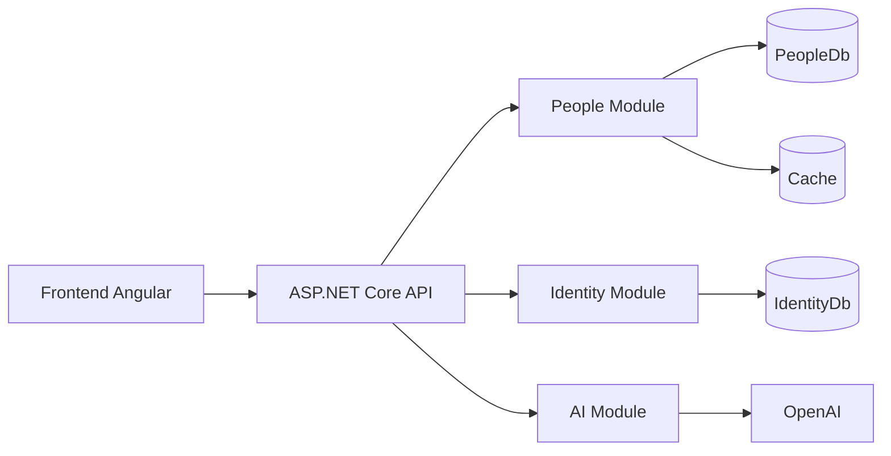
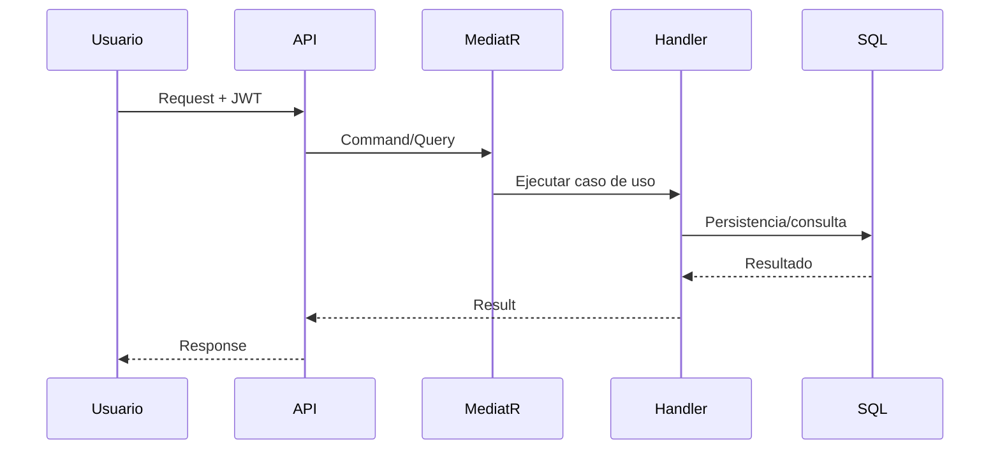

# Deck de Presentacion - Ficticia

Este archivo funciona como guion de slides en markdown.

## Slide 1 - Portada
- Ficticia
- Gestion Inteligente de Personas, Atributos y Riesgo
- Presentacion para Cliente y Equipo Tecnico

## Slide 2 - Problema
- Datos fragmentados.
- Procesos manuales y lentos.
- Baja estandarizacion para analitica y riesgo.

## Slide 3 - Solucion
- Plataforma unica para personas.
- Catalogo de atributos dinamicos.
- IA para normalizacion y scoring.
- Seguridad por roles.

## Slide 4 - Valor para negocio
- Rapida adaptacion a nuevos requisitos.
- Mejor calidad de dato.
- Menor tiempo operativo.
- Base para decisiones asistidas.

## Slide 5 - Arquitectura

## Slide 6 - Flujo de una operacion

## Slide 7 - Seguridad
- JWT + roles.
- People.Read: Admin, Manager, Viewer.
- People.Write: Admin, Manager.
- Attributes.Manage: Admin.
- Pruebas automatizadas de autorizacion por rol.

## Slide 8 - Demo funcional
1. Login.
2. Crear persona.
3. Cargar atributos.
4. Buscar por filtros dinamicos.
5. Ejecutar normalizacion IA.
6. Ejecutar risk score.

## Slide 9 - Calidad y CI
- Unit tests + Integration tests.
- Pipeline GitHub Actions backend/frontend.
- Reportes TRX para trazabilidad.

## Slide 10 - Roadmap
- Fase 1: hardening productivo.
- Fase 2: auditoria y permisos granulares.
- Fase 3: madurez IA y metricas de calidad.
- Fase 4: compliance y gobierno de datos.

## Slide 11 - Riesgos y mitigaciones
- Dependencias externas -> fallback y controles.
- Cambios de negocio -> catalogo dinamico + pruebas.
- Seguridad -> RBAC y pruebas de autorizacion.

## Slide 12 - Cierre
- Solucion lista para evolucion.
- Base tecnica solida.
- Siguiente paso: plan de despliegue y fase 1.

