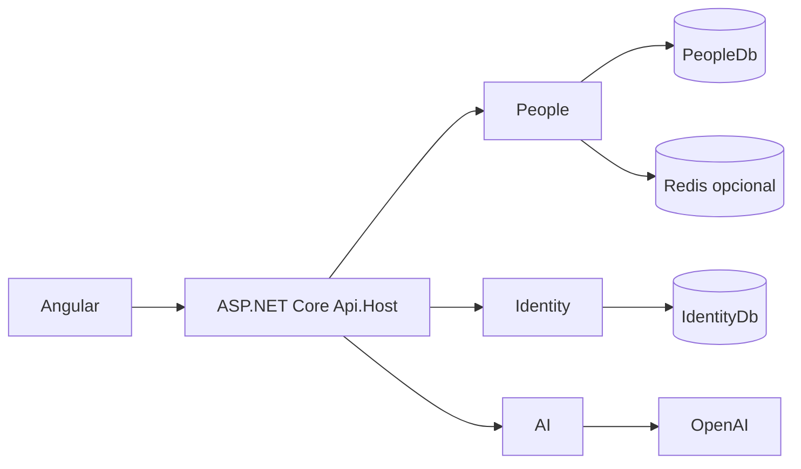
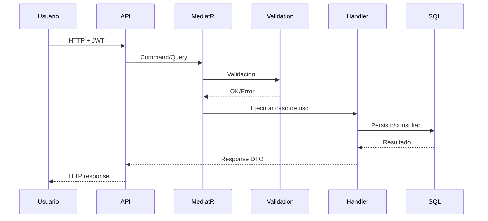

# Deck de Presentacion - Ficticia

Guion de slides en markdown para cliente + equipo tecnico.

## Slide 1 - Portada
- Ficticia
- Gestion de Personas, Atributos Dinamicos e IA Aplicada
- Estado actual y roadmap

## Slide 2 - Problema
- Datos de personas dispersos y heterogeneos.
- Alta friccion para agregar campos de negocio.
- Evaluacion de riesgo lenta y manual.

## Slide 3 - Solucion
- Plataforma unica para operar personas.
- Catalogo de atributos configurable.
- IA para normalizacion y scoring.
- Seguridad por roles desde el diseno.

## Slide 4 - Valor de negocio
- Menor time-to-market para cambios funcionales.
- Mejor calidad de datos.
- Menor riesgo operativo por control de acceso.
- Base para escalamiento analitico.

## Slide 5 - Arquitectura

```mermaid
flowchart LR
  FE[Angular] --> API[ASP.NET Core Api.Host]
  API --> PPL[People]
  API --> IDN[Identity]
  API --> AIM[AI]
  PPL --> SQLP[(PeopleDb)]
  IDN --> SQLI[(IdentityDb)]
  PPL --> REDIS[(Redis opcional)]
  AIM --> OAI[OpenAI]
```

## Slide 6 - Flujo operativo

```mermaid
sequenceDiagram
  participant U as Usuario
  participant API as API
  participant M as MediatR
  participant V as Validation
  participant H as Handler
  participant DB as SQL

  U->>API: HTTP + JWT
  API->>M: Command/Query
  M->>V: Validacion
  V-->>M: OK/Error
  M->>H: Ejecutar caso de uso
  H->>DB: Persistir/consultar
  DB-->>H: Resultado
  H-->>API: Response DTO
  API-->>U: HTTP response
```

## Slide 7 - Cambios tecnicos recientes
- Startup SQL resiliente (wait + retry + lock de migraciones).
- Logging estructurado HTTP + CQRS.
- Seed idempotente de catalogos, roles y admin.
- Paginacion y filtros dinamicos consolidados en UI.

## Slide 8 - Casos de uso cubiertos
1. Alta/edicion/estado de personas.
2. Gestion de definiciones de atributos.
3. Carga de atributos por persona con reglas.
4. Busqueda dinamica paginada.
5. Normalizacion IA + score de riesgo.

## Slide 9 - Seguridad
- JWT Bearer.
- Policies:
  - People.Read: Admin/Manager/Viewer.
  - People.Write: Admin/Manager.
  - Attributes.Manage: Admin.
- Pruebas de autorizacion por rol automatizadas.

## Slide 10 - Calidad y confiabilidad
- Unit tests: reglas y validadores.
- Integration tests: auth, roles, people, attributes, IA.
- CI valida backend y frontend en cada cambio.

## Slide 11 - Demo sugerida
1. Login.
2. Crear persona.
3. Cargar atributos.
4. Buscar por `attr.condition_code`.
5. Normalizar condicion.
6. Calcular riesgo.

## Slide 12 - Roadmap
- Fase 1: observabilidad y hardening productivo.
- Fase 2: auditoria y permisos granulares.
- Fase 3: madurez IA (fallback + metricas de calidad).
- Fase 4: compliance y gobierno de datos sensibles.

## Slide 13 - Cierre
- Plataforma funcional y escalable.
- Arquitectura modular preparada para evolucion.
- Propuesta de siguientes entregables priorizados.
