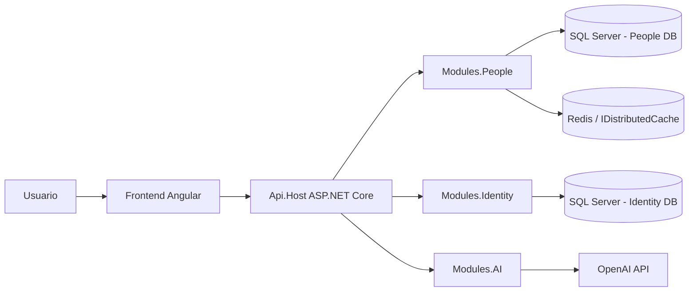
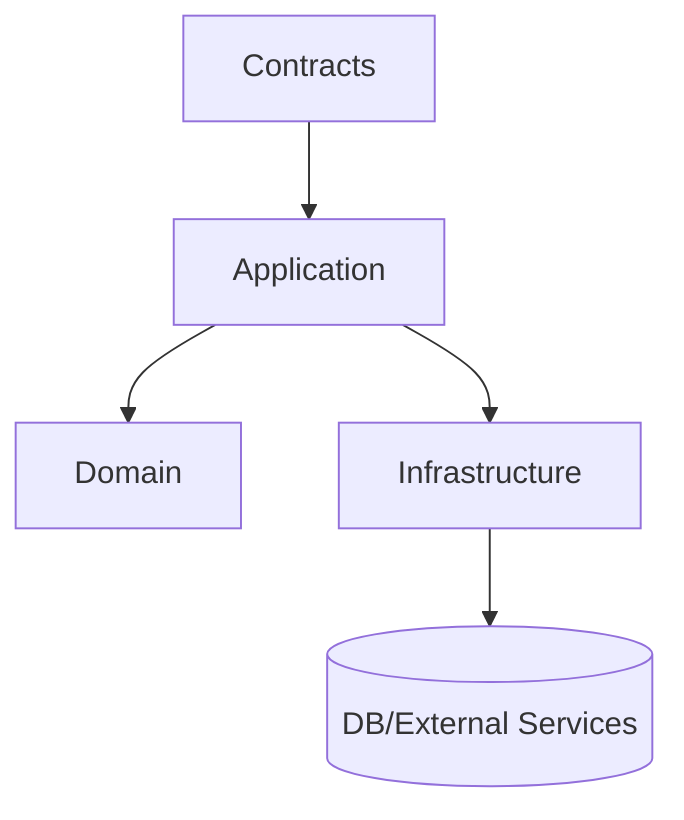
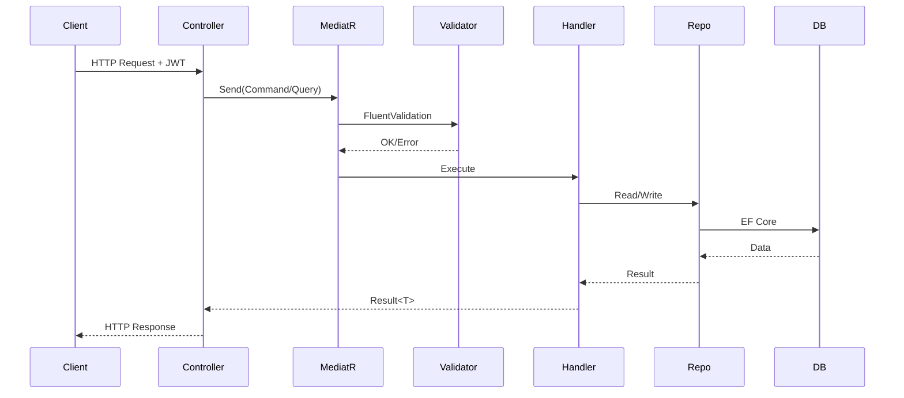
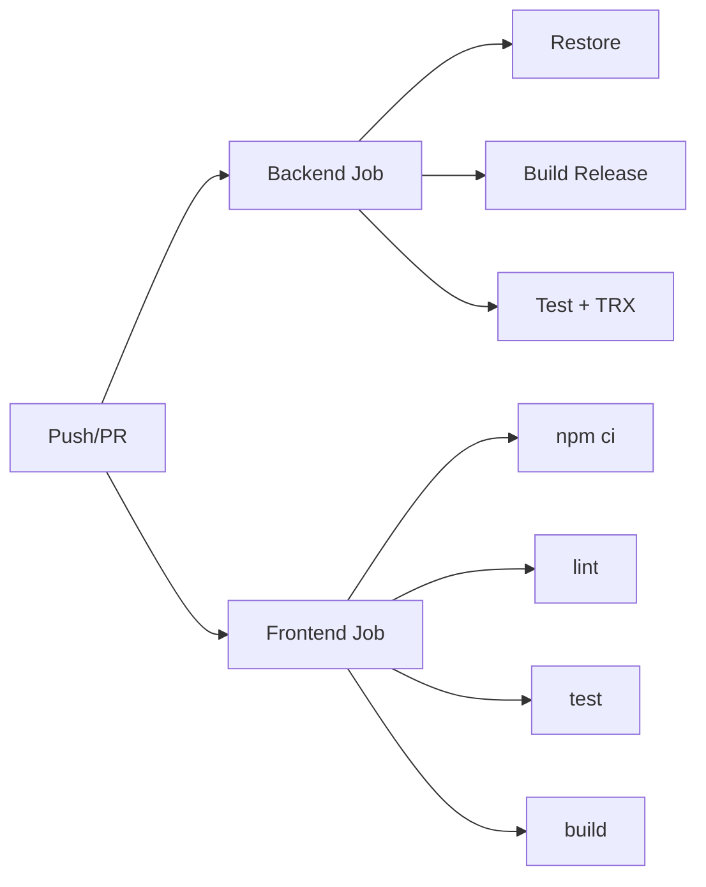

# Ficticia

Plataforma full-stack para gestión de personas, atributos dinámicos y capacidades de IA aplicada (normalización de condiciones y scoring de riesgo), orientada a operación empresarial con control de acceso por roles.

## 1) Resumen Ejecutivo (Cliente)

### ¿Para qué sirve este proyecto?
- Centraliza la administración de personas.
- Permite configurar un catálogo de atributos sin cambiar código por cada nuevo campo de negocio.
- Guarda atributos por persona con validaciones de tipo y reglas de negocio.
- Incluye capacidades de IA para:
- normalizar texto de condiciones médicas a códigos consistentes.
- calcular un score de riesgo de forma explicable.

### Beneficio para negocio
- Menor tiempo para incorporar nuevos requerimientos de datos (atributos configurables).
- Mejor calidad de información (validaciones y normalización).
- Base para decisiones asistidas por IA en evaluación de riesgo.
- Seguridad y trazabilidad con autenticación JWT y autorización por roles.

### Estado actual del producto
- API backend modular en .NET.
- Frontend Angular preparado para consumir API.
- Pruebas unitarias e integración en CI.
- Pipeline automatizado con validación de backend y frontend.

## 2) Resumen Técnico (Arquitectura)

### Stack tecnológico
- Backend: ASP.NET Core (.NET `net10.0`), MediatR, FluentValidation, Entity Framework Core, SQL Server, Identity + JWT.
- IA: módulo desacoplado con proveedor OpenAI y fallback configurable.
- Cache: `IDistributedCache` (Redis en runtime; memory cache en tests).
- Frontend: Angular 21, TypeScript, Vitest.
- CI: GitHub Actions.

### Estructura de solución
```text
Ficticia.slnx
backend/
  src/
    Api.Host/                      # API HTTP, composición de módulos, middlewares
    BuildingBlocks/
      BuildingBlocks.Abstractions/
      BuildingBlocks.Infrastructure/
    Modules/
      Modules.People/              # Dominio principal (personas + atributos)
        Application/
        Contracts/
        Domain/
        Infrastructure/
      Modules.Identity/
        Application/
        Contracts/
        Infrastructure/
      Modules.AI/
        Application/
        Contracts/
        Infrastructure/
  tests/
    Modules.People.UnitTests/
    Modules.People.IntegrationTests/
frontend/
docker/
```

### Diagrama de arquitectura (alto nivel)


### Modelo de capas por módulo


## 3) Flujo de negocio principal

### 3.1 Gestión de personas
- Crear persona.
- Actualizar datos personales.
- Cambiar estado activo/inactivo.
- Consultar por ID.
- Buscar por filtros estáticos y dinámicos.

### 3.2 Atributos dinámicos
- Catálogo de definiciones configurable (`key`, tipo, reglas).
- Carga/actualización de valores por persona.
- Validación de:
- shape (solo un tipo de valor por atributo).
- regla de negocio (`required`, `allowedValues`, `regex`, `min/max`, `minDate/maxDate`).

### 3.3 IA aplicada
- Normalización de condición (`/ai/conditions/normalize`).
- Scoring de riesgo por persona (`/ai/people/{id}/risk-score`).
- Manejo de errores de proveedor con respuesta controlada.

### Flujo de request (backend)


## 4) Seguridad y control de acceso

### Autenticación
- JWT Bearer token.
- Login vía `POST /api/v1/auth/login`.
- Claims incluyen roles.

### Autorización (políticas)
- `People.Read`: `Admin`, `Manager`, `Viewer`
- `People.Write`: `Admin`, `Manager`
- `Attributes.Manage`: `Admin`

### Matriz de permisos (resumen)
| Endpoint | Policy | Admin | Manager | Viewer |
|---|---|---:|---:|---:|
| `GET /api/v1/people` y lecturas People | People.Read | OK | OK | OK |
| `POST /api/v1/people` y escrituras People | People.Write | OK | OK | FORBIDDEN |
| `GET/POST/PUT /api/v1/attributes/definitions` | Attributes.Manage | OK | FORBIDDEN | FORBIDDEN |
| `POST /api/v1/ai/*` | People.Read | OK | OK | OK |

## 5) API funcional (catálogo)

### Auth
- `POST /api/v1/auth/login`

### People
- `POST /api/v1/people`
- `PUT /api/v1/people/{id}`
- `PATCH /api/v1/people/{id}/status`
- `GET /api/v1/people/{id}`
- `GET /api/v1/people`
- `PUT /api/v1/people/{personId}/attributes`
- `GET /api/v1/people/{personId}/attributes`
- `GET /api/v1/people/{personId}/attributes/form`

### Attributes
- `GET /api/v1/attributes/definitions`
- `POST /api/v1/attributes/definitions`
- `PUT /api/v1/attributes/definitions/{id}`

### AI
- `POST /api/v1/ai/conditions/normalize`
- `POST /api/v1/ai/people/{personId}/risk-score`

## 6) Base de datos y persistencia

- Dos contextos separados:
- `PeopleDb` (personas, definiciones y valores de atributos).
- `IdentityDb` (usuarios, roles, auth).
- Migrations en `Infrastructure/Migrations` por módulo.
- Seeds al arranque:
- atributos base de negocio (ej. `condition_code`).
- roles (`Admin`, `Manager`, `Viewer`).
- usuario admin inicial (`admin@ficticia.local` / `Admin123!` en desarrollo).

## 7) Configuración y entornos

### Variables clave
- `ConnectionStrings:PeopleDb`
- `ConnectionStrings:IdentityDb`
- `Jwt:Issuer`, `Jwt:Audience`, `Jwt:Key`, `Jwt:ExpiresMinutes`
- `OpenAI:ApiKey`, `OpenAI:Model`, `OpenAI:BaseUrl`
- `RiskRules:*`

### Runtime local
- SQL Server en `localhost:1433`.
- Redis en `localhost:6379` (opcional para cache distribuida).

### Docker (infra local)
Archivo: `docker/docker-compose.yml`
- SQL Server 2022
- Redis 7

## 8) Flujo de desarrollo

### Arranque recomendado
1. Levantar infraestructura:
```bash
docker compose -f docker/docker-compose.yml up -d
```
2. Backend:
```bash
cd backend/src/Api.Host
dotnet restore ../../../Ficticia.slnx
dotnet run
```
3. Frontend:
```bash
cd frontend
npm ci
npm run start
```

### Migrations (si aplica)
Script base: `init-db.sh`

## 9) Testing y calidad

### Tipos de prueba
- Unit tests: validaciones y reglas de negocio.
- Integration tests: endpoints, seguridad, persistencia real y flujos E2E de API.

### Suite actual
- `backend/tests/Modules.People.UnitTests`
- `backend/tests/Modules.People.IntegrationTests`

### Comandos
```bash
dotnet test Ficticia.slnx
dotnet test backend/tests/Modules.People.UnitTests/Modules.People.UnitTests.csproj
dotnet test backend/tests/Modules.People.IntegrationTests/Modules.People.IntegrationTests.csproj
```

## 10) CI/CD workflow

Pipeline en `.github/workflows/ci.yml`:

### Job backend
1. Checkout
2. Setup .NET 10
3. Restore solución
4. Build Release
5. Test Release (`dotnet test ../Ficticia.slnx -c Release --no-build`)
6. Publicación de `.trx` como artifact

Incluye servicio SQL Server para pruebas de integración.

### Job frontend
1. Checkout
2. Setup Node 20
3. `npm ci`
4. lint
5. tests
6. build

### Diagrama de pipeline


## 11) Observabilidad y operación

- `RequestLoggingMiddleware`: logging de requests.
- `ExceptionMiddleware`: manejo global de excepciones.
- Errores de validación devueltos como `ProblemDetails`.
- Swagger habilitado para documentación y pruebas manuales.

## 12) Roadmap propuesto

### Fase 1: Productización técnica
- Configuración por ambiente (`dev/stg/prod`) robusta.
- Endurecimiento de secretos (KeyVault/Secrets Manager).
- Health checks y readiness/liveness.
- Logging estructurado + trazas distribuidas.

### Fase 2: Escalabilidad funcional
- Versionado formal de API.
- Paginación/ordenamiento/filtros avanzados y consistentes.
- Auditoría de cambios sobre atributos y personas.
- Reglas de negocio administrables desde panel.

### Fase 3: IA confiable
- Guardrails de prompts y validación de respuestas IA.
- Métricas de calidad de normalización/riesgo.
- Evaluación offline con dataset curado.
- Estrategia fallback multi-proveedor.

### Fase 4: Gobierno y compliance
- Gestión de consentimiento y datos sensibles.
- Políticas de retención y enmascaramiento.
- Endurecimiento de RBAC por permisos granulares.

## 13) Riesgos y mitigaciones

| Riesgo | Impacto | Mitigación |
|---|---|---|
| Dependencia de servicios externos (OpenAI, Redis) | Interrupción funcional parcial | Fallbacks, timeouts, circuit breakers, cache local |
| Cambios en reglas de negocio | Errores de validación/compatibilidad | Catálogo versionado y suite de regresión |
| Deriva de seguridad (roles/permisos) | Acceso indebido | Tests de autorización por rol + revisión periódica de políticas |
| Calidad de datos de entrada | Resultados de IA inconsistentes | Normalización previa, validadores, reglas explícitas |

## 14) Guía de presentación al cliente

### Narrativa sugerida (10-15 min)
1. Problema de negocio actual.
2. Solución: personas + atributos dinámicos + IA.
3. Demostración corta:
- login.
- alta de persona.
- carga de atributo.
- búsqueda dinámica.
- normalización y score.
4. Seguridad por roles.
5. Roadmap y próximos entregables.

### Mensajes clave para cliente
- El modelo es configurable y evolutivo.
- Hay control de acceso por roles desde el diseño.
- El sistema está cubierto por pruebas automáticas.
- La IA está encapsulada y puede evolucionar sin romper el core.

## 15) Guía de presentación al equipo técnico

### Narrativa sugerida (20-30 min)
1. Arquitectura modular y separación por capas.
2. Flujo request -> MediatR -> validator -> handler -> repositorio.
3. Modelo de datos y validación de atributos dinámicos.
4. Integración de Identity/JWT y policies.
5. Testing strategy (unit + integration + role authorization).
6. CI/CD y hardening para producción.

### Checklist técnico para handoff
- [ ] Variables de entorno definidas por ambiente.
- [ ] SQL y Redis operativos en entorno destino.
- [ ] Migraciones aplicadas.
- [ ] Usuario admin bootstrap deshabilitado/rotado en producción.
- [ ] OpenAI key segura y políticas de fallback activas.
- [ ] Pipeline CI con artefactos de test y alertas habilitadas.

## 16) Estado de madurez actual

- Backend funcional con diseño modular sólido.
- API con autenticación/autorización y cobertura de tests.
- Integración de IA operativa y desacoplada.
- Frontend base listo para extender casos de uso.