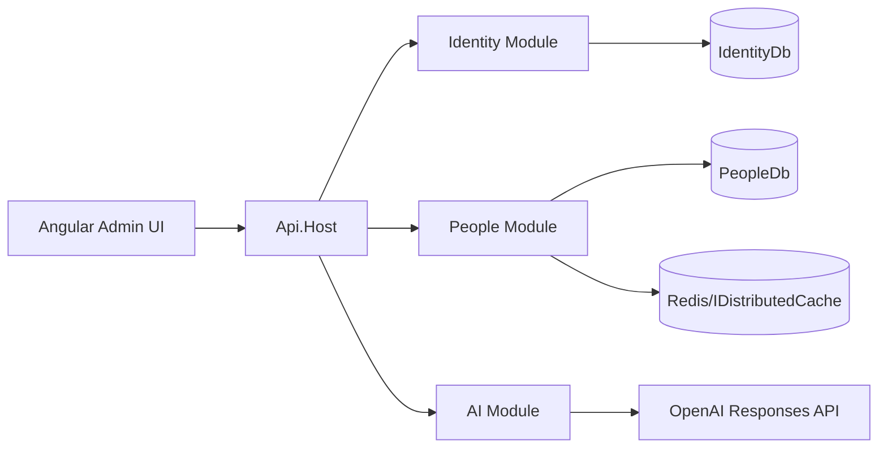

# Ficticia

Plataforma full-stack para gestion de personas, atributos dinamicos y capacidades de IA (normalizacion de condiciones y scoring de riesgo), con seguridad por roles y arquitectura modular.

## 1. Estado actual y cambios recientes

### Cambios incorporados en esta etapa
- Arranque robusto de SQL Server en startup:
  - espera activa de disponibilidad de servidor.
  - reintentos ante errores transitorios.
  - lock distribuido por base (`sp_getapplock`) para evitar carreras de migracion.
  - creacion idempotente de base y tolerancia a `Database already exists`.
- Logging estructurado con Serilog:
  - formato unificado con `Component` y `TraceId`.
  - bootstrap logger desde el inicio del host.
- Pipeline MediatR mejorado:
  - `LoggingBehavior` para trazabilidad de commands/queries.
  - `ValidationBehavior` para registrar y abortar requests invalidas.
- Hardening de seed de People e Identity:
  - migraciones seguras en concurrencia.
  - usuarios demo por rol (`Admin`, `Manager`, `Viewer`) idempotentes.
- Frontend Angular consolidado para:
  - paginacion (page/pageSize, rango visible, ellipsis).
  - filtros dinamicos tipados por atributos.
  - flujo integrado de IA (normalizar condicion + score de riesgo + aplicar sugerencias).

### Resultado operativo
- API productiva para CRUD de personas + atributos + IA + auth.
- Frontend de administracion funcional contra API.
- Cobertura automatizada en unit tests + integration tests + CI.

## 2. Arquitectura

### Stack
- Backend: ASP.NET Core (`net10.0`), MediatR, FluentValidation, EF Core, SQL Server.
- Seguridad: ASP.NET Identity + JWT Bearer + policies.
- IA: modulo desacoplado (OpenAI) + contratos internos por interfaz.
- Cache: `IDistributedCache` (Redis opcional en runtime, memory cache en tests).
- Frontend: Angular 21 + TypeScript + Vitest.
- CI: GitHub Actions.

### Estructura
```text
Ficticia.slnx
backend/
  src/
    Api.Host/
    BuildingBlocks/
    Modules/
      Modules.People/
      Modules.Identity/
      Modules.AI/
  tests/
    Modules.People.UnitTests/
    Modules.People.IntegrationTests/
frontend/
docker/
```

### Vista general

```mermaid
flowchart LR
  UI[Angular Admin UI] --> API[Api.Host]
  API --> IDN[Identity Module]
  API --> PPL[People Module]
  API --> AIM[AI Module]
  IDN --> SQLI[(IdentityDb)]
  PPL --> SQLP[(PeopleDb)]
  PPL --> CACHE[(Redis/IDistributedCache)]
  AIM --> OAI[OpenAI Responses API]
```

## 3. Funcionamiento end-to-end

### Startup del backend
1. Configura Serilog bootstrap.
2. Construye servicios (Identity, JWT, authorization, modules, MediatR, validators, middlewares).
3. Espera SQL Server listo para `PeopleDb` e `IdentityDb`.
4. Ejecuta seed por pasos:
   - lock exclusivo por DB.
   - ensure DB exists.
   - aplica migraciones pendientes con retry.
   - seed de catalogo People + roles/usuarios demo Identity.
5. Expone Swagger, middlewares, auth y controllers.

### Pipeline HTTP/CQRS
1. `RequestLoggingMiddleware` registra request/response con tiempo y `TraceId`.
2. Controller traduce HTTP -> command/query.
3. `LoggingBehavior` registra inicio/fin/fallo de CQRS.
4. `ValidationBehavior` corta flujo si hay errores FluentValidation.
5. Handler ejecuta caso de uso.
6. `ExceptionMiddleware` normaliza errores en `ProblemDetails`.

## 4. Modulos funcionales

### People
- Crear persona.
- Actualizar persona.
- Activar/desactivar persona.
- Obtener por ID.
- Buscar con filtros estaticos y dinamicos.
- Gestionar atributos por persona.
- Obtener formulario de atributos para edicion.

### Attributes
- Listar definiciones (activas o todas).
- Crear definicion.
- Actualizar definicion (displayName, reglas, activacion, filterable).

### Identity
- Login email/password.
- Emision de JWT con roles.
- Roles bootstrap: `Admin`, `Manager`, `Viewer`.

### AI
- Normalizacion de condicion (`conditions/normalize`).

## 5. Seguridad y permisos

### Policies
- `People.Read`: `Admin`, `Manager`, `Viewer`.
- `People.Write`: `Admin`, `Manager`.
- `Attributes.Manage`: `Admin`.

### Matriz simplificada
| Capacidad | Viewer | Manager | Admin |
|---|---|---|---|
| Leer personas | Si | Si | Si |
| Crear personas (`POST /people`) | No | Si | Si |
| Editar estado/datos (`PUT/PATCH /people`) | Si (actual) | Si | Si |
| Gestionar definiciones | No | No | Si |
| Usar endpoints AI | Si | Si | Si |

## 6. Endpoints API

### Auth
- `POST /api/v1/auth/login`

### People
- `POST /api/v1/people`
- `PUT /api/v1/people/{id}`
- `PATCH /api/v1/people/{id}/status`
- `GET /api/v1/people/{id}`
- `GET /api/v1/people`
- `PUT /api/v1/people/{personId}/attributes`
- `GET /api/v1/people/{personId}/attributes`
- `GET /api/v1/people/{personId}/attributes/form`

### Attributes
- `GET /api/v1/attributes/definitions`
- `POST /api/v1/attributes/definitions`
- `PUT /api/v1/attributes/definitions/{id}`

### AI
- `POST /api/v1/ai/conditions/normalize`

## 7. Casos de uso cubiertos

### 7.1 Operacion de personas
- Alta y consulta por ID.
- Edicion completa y control de conflictos por identificacion duplicada.
- Cambio de estado activo/inactivo.

### 7.2 Datos dinamicos
- Catalogo de atributos configurable por negocio.
- Validacion por tipo (`Boolean`, `String`, `Number`, `Date`, `Enum`).
- Reglas (`required`, `allowedValues`, `regex`, `min/max`, `minDate/maxDate`).
- Carga y limpieza de valores por persona.

### 7.3 Busqueda avanzada
- Filtros estaticos: nombre, documento, estado, rango edad.
- Filtros dinamicos por querystring:
  - `attr.condition_code=diabetes`
  - `attr[condition_code]=diabetes`
- Paginacion backend: `page`, `pageSize`.

### 7.4 IA aplicada
- Normalizacion desde texto libre a codigo de condicion.
- Sugerencias de atributos derivadas del resultado.
- Manejo controlado de fallas de proveedor.

## 8. Cobertura de pruebas

### Integration tests cubren
- Auth:
  - login exitoso y fallido.
  - autorizacion por rol (Viewer/Manager/Admin).
- People:
  - CRUD, not-found, conflictos, validacion, filtros dinamicos.
- Attributes:
  - lectura de catalogo seed, alta, update, duplicados, validaciones.
- IA:
  - auth requerida.
  - provider ok/fail.

### Unit tests cubren
- `AttributeValueShapeValidator`: shape y consistencia tipo-valor.
- `AttributeRulesValidator`: reglas de enum/string/number/date y bordes.

## 9. Configuracion

### Claves principales
- `ConnectionStrings:PeopleDb`
- `ConnectionStrings:IdentityDb`
- `Jwt:Issuer`, `Jwt:Audience`, `Jwt:Key`, `Jwt:ExpiresMinutes`
- `OpenAI:ApiKey`, `OpenAI:BaseUrl`, `OpenAI:Model`, `OpenAI:ConfidenceThreshold`
- `Redis:ConnectionString` (opcional)

### Credenciales de desarrollo seed
- `admin@ficticia.local` / `Admin123!` (`Admin`)
- `manager@ficticia.local` / `Manager123!` (`Manager`)
- `viewer@ficticia.local` / `Viewer123!` (`Viewer`)

## 10. Ejecucion local

### 1) Infra
```bash
docker compose -f docker/docker-compose.yml up -d --wait --wait-timeout 180
```

### 2) Backend
```bash
cd backend/src/Api.Host
dotnet restore ../../../Ficticia.slnx
dotnet run
```

### 3) Frontend
```bash
cd frontend
npm ci
npm start
```

## 11. Debug y desarrollo

### Swagger
- URL backend local: `http://localhost:5000/swagger` o puerto asignado por `dotnet run`.

### VS Code
- Existe perfil `Debug Api.Host` en `.vscode/launch.json`.
- Existe perfil `Debug Angular (Chrome)` en `.vscode/launch.json`.
- Tareas de Docker en `.vscode/tasks.json` para levantar/bajar infraestructura.

## 12. CI

Workflow: `.github/workflows/ci.yml`

### Backend
- Restore + Build Release + `dotnet test` con SQL Server service.
- Publica `trx` como artifact.

### Frontend
- `npm ci`
- lint (`--if-present`)
- test (`--if-present`)
- build

## 13. Limitaciones y siguientes pasos

### Limitaciones actuales
- El flujo IA depende de `OpenAI:ApiKey` valido para entorno real.
- La normalizacion de condicion implementa sugerencias, pero el fallback de diccionario no esta conectado en la ruta principal.
- `OpenAI:ConfidenceThreshold` debe usarse como clave de configuracion (no `NormalizeConfidenceThreshold`).
- `PUT/PATCH /api/v1/people` hoy quedan protegidos por `People.Read`; falta endurecerlos con `People.Write`.

### Siguientes pasos recomendados
1. Incorporar health checks/liveness/readiness.
2. Completar trazabilidad distribuida (OpenTelemetry + dashboards).
3. Endurecer gestion de secretos por ambiente.
4. Agregar pruebas E2E UI sobre los casos de negocio criticos.
