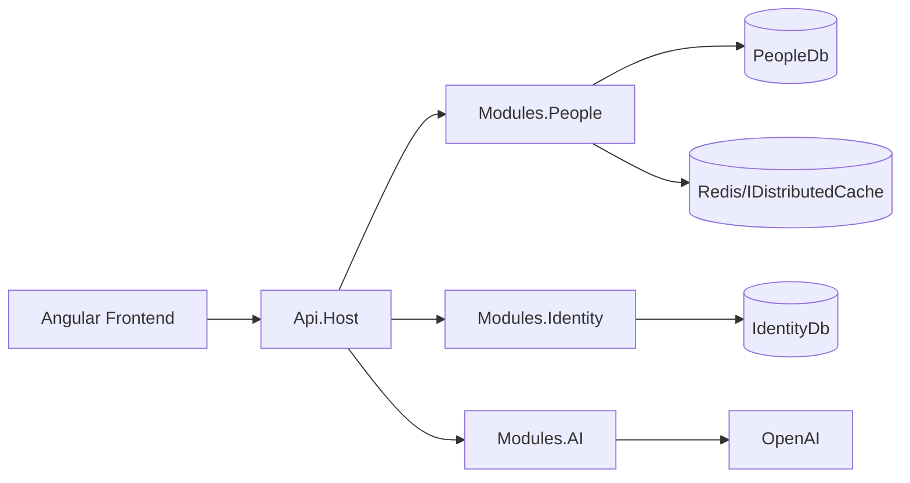
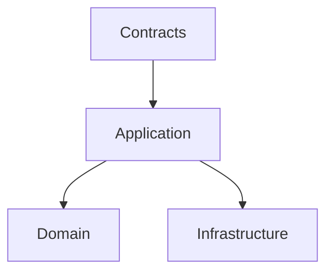
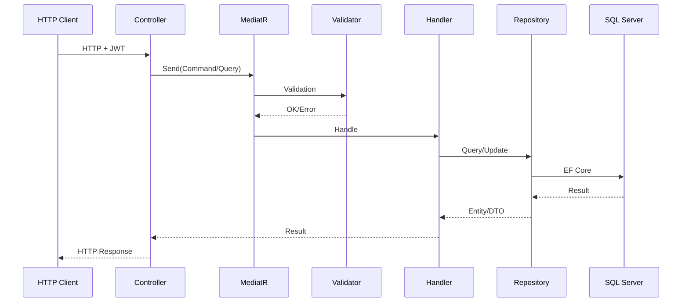

# Ficticia - Documento Tecnico

## 1. Alcance tecnico
Este documento describe arquitectura, componentes, flujos, seguridad, operacion, testing y lineamientos de evolucion del proyecto Ficticia.

## 2. Stack
- Backend: ASP.NET Core (.NET 10), EF Core, MediatR, FluentValidation.
- Identidad: ASP.NET Identity + JWT.
- Datos: SQL Server (PeopleDb e IdentityDb).
- Cache: IDistributedCache (Redis en runtime; memory cache en tests).
- IA: modulo desacoplado con proveedor OpenAI.
- Frontend: Angular 21 + TypeScript + Vitest.
- CI: GitHub Actions.

## 3. Estructura de solucion
```text
Ficticia.slnx
backend/src/Api.Host
backend/src/BuildingBlocks/*
backend/src/Modules/Modules.People/*
backend/src/Modules/Modules.Identity/*
backend/src/Modules/Modules.AI/*
backend/tests/*
frontend/*
```

## 4. Arquitectura

### 4.1 Vista general


### 4.2 Patrón por capas


## 5. Pipeline de request


## 6. Modulos funcionales

### 6.1 People
- Comandos: create, update, set status, upsert attributes.
- Queries: get by id, search, get attributes, get attribute form.
- Validaciones:
- shape de valor por tipo.
- reglas de negocio (`required`, `allowedValues`, `regex`, `min/max`, `minDate/maxDate`).

### 6.2 Attributes
- Definicion de catalogo dinamico.
- Alta y actualizacion de definiciones.
- Integracion con cache de catalogo.

### 6.3 Identity
- Login con email/password.
- JWT con claims y roles.
- Roles seed: `Admin`, `Manager`, `Viewer`.

### 6.4 AI
- Normalizacion de condicion.
- Risk score por persona.
- Manejo de errores de proveedor encapsulado.

## 7. Seguridad

### 7.1 Politicas
- `People.Read`: Admin, Manager, Viewer
- `People.Write`: Admin, Manager
- `Attributes.Manage`: Admin

### 7.2 Endpoints protegidos
- People y AI requieren `People.Read` (con write donde corresponde).
- Attributes requiere `Attributes.Manage`.

## 8. Endpoints API

### Auth
- `POST /api/v1/auth/login`

### People
- `POST /api/v1/people`
- `PUT /api/v1/people/{id}`
- `PATCH /api/v1/people/{id}/status`
- `GET /api/v1/people/{id}`
- `GET /api/v1/people`
- `PUT /api/v1/people/{personId}/attributes`
- `GET /api/v1/people/{personId}/attributes`
- `GET /api/v1/people/{personId}/attributes/form`

### Attributes
- `GET /api/v1/attributes/definitions`
- `POST /api/v1/attributes/definitions`
- `PUT /api/v1/attributes/definitions/{id}`

### AI
- `POST /api/v1/ai/conditions/normalize`
- `POST /api/v1/ai/people/{personId}/risk-score`

## 9. Datos y configuracion
- DBs:
- `ConnectionStrings:PeopleDb`
- `ConnectionStrings:IdentityDb`
- JWT:
- `Jwt:Issuer`, `Jwt:Audience`, `Jwt:Key`, `Jwt:ExpiresMinutes`
- OpenAI:
- `OpenAI:ApiKey`, `OpenAI:Model`, `OpenAI:BaseUrl`
- Risk rules:
- `RiskRules:*`

## 10. Ejecucion local

### Infraestructura
```bash
docker compose -f docker/docker-compose.yml up -d
```

### Backend
```bash
cd backend/src/Api.Host
dotnet restore ../../../Ficticia.slnx
dotnet run
```

### Frontend
```bash
cd frontend
npm ci
npm run start
```

## 11. Testing

### Unit
```bash
dotnet test backend/tests/Modules.People.UnitTests/Modules.People.UnitTests.csproj
```

### Integration
```bash
dotnet test backend/tests/Modules.People.IntegrationTests/Modules.People.IntegrationTests.csproj
```

## 12. CI/CD
Workflow: `.github/workflows/ci.yml`

### Backend job
1. Restore.
2. Build Release.
3. Test Release con TRX.
4. Upload de artefactos de pruebas.

### Frontend job
1. `npm ci`
2. lint
3. test
4. build

## 13. Observabilidad
- Request logging middleware.
- Exception middleware con `ProblemDetails`.
- Swagger habilitado.

## 14. Riesgos tecnicos y mitigaciones
- Redis no disponible en CI/local.
- Mitigacion: memory distributed cache en tests.
- Dependencia de OpenAI.
- Mitigacion: encapsulacion de proveedor, fallback, timeouts.
- Cambios de negocio en atributos.
- Mitigacion: catalogo dinamico y suite de regresion.

## 15. Roadmap tecnico
1. Health checks + readiness/liveness.
2. Telemetria distribuida + dashboards.
3. Versionado formal de API.
4. Auditoria de cambios.
5. Hardening de secretos.
6. Pruebas contract/e2e.

